# Type-specific Kotlin collections
The purpose of this project is analyzing possibility of implementing collections with primitive values stored.

Desired properties of collections:
* Kotlin-multiplatform library
* implementing standard interfaces like `MutableList`, `MutableMap`
* advantage about two times in memory
* better operating with a cache than standard implementation
* linked implementations of Map and Set

## Map

Two possible implementations were considered - open addressing and chained.

In both cases some common optimizations were used:
* power of two capacity in order to avoid `mod` operation
* multiplicative Knuth hash

### [Open addressing](https://en.wikipedia.org/wiki/Open_addressing)

* uses linear probing
* eager deletion

Implementation of `MutableMap<Long, Long>` is [here](https://github.com/zuevmaxim/TypeSpecificCollections/blob/master/src/commonMain/kotlin/example/LongLongLinkedHashMap.kt).

Advantages:
* better operating with a cache as it uses only one array for navigating
* smaller memory usage in case of big load factor
* could be used for Object map implementation with some advantage in memory

Disadvantages:
* problems with collisions as all elements are stored sequentially in one array
* memory usage highly depends on capacity rather than size

### [Chained](https://en.wikipedia.org/wiki/Hash_table#Separate_chaining)

Idea: store fields of nodes from standard implementation in several arrays(keys, values, next).

Implementation of `MutableMap<Long, Long>` is [here](https://github.com/zuevmaxim/TypeSpecificCollections/blob/master/src/commonMain/kotlin/example/ChainedLinkedHashMap.kt).

Advantages:
* algorithmically equivalent to standard implementation(better resolution of collisions than open addressing)
* dense memory usage
* memory usage depends on capacity * load factor - approximately size
* smaller memory usage in case of small load factor

Disadvantages:
* needs several extra arrays (free indexes, head indexes)
* uses two arrays for navigation
* higher memory usage for small primitives(byte, short, int)
* could **not** be used for Object map implementation

### Open addressing vs Chained
#### Memory usage

Table contains average advantage of implementations to the standard one in case of load factor 0,6.

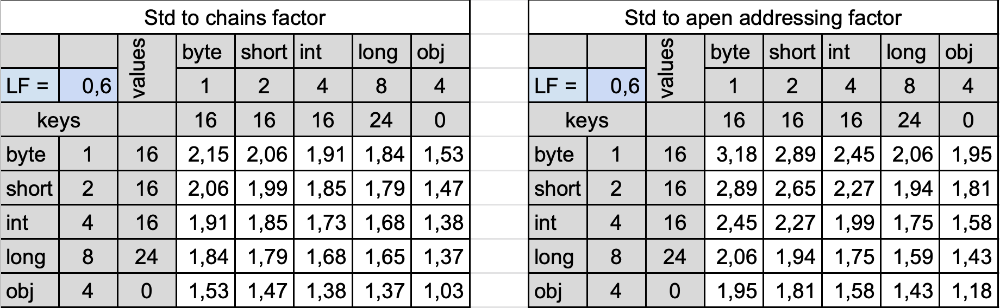

* chained implementation is better in case of Map<Long, Long>
* for other primitives open addressing has better memory usage
* chained implementation is unused in case of Map<Object, Object> (advantage is less than 1 in worst case)

Some other calculations of memory usage are [here](https://docs.google.com/spreadsheets/d/1kkx25AV-ooflnOoD7Oil_BTGXvvAFprYQuEbjiR2GPI/edit?usp=sharing).

#### Performance(get)

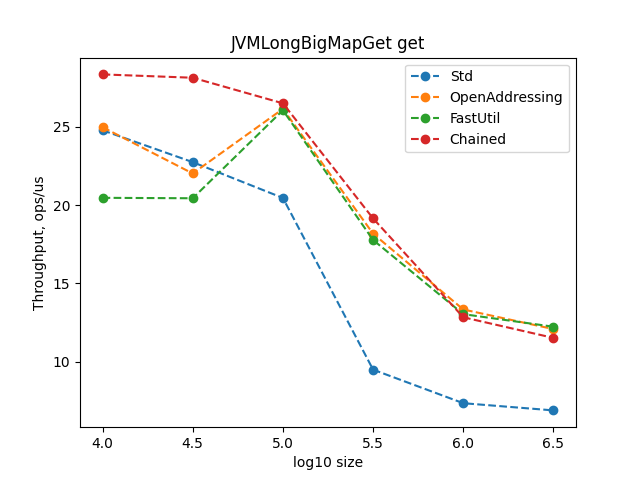

When size of hash map is big enough we can see a great improvements in performance comparing with standard implementation.

### Other primitives

Two possible implementations of other than long primitives were considered:
* store everything as long and redirect all calls to LongLongMap
* implement a generic version of hash map with specialized storage for primitive elements

#### Long implementation redirecting

* higher memory usage

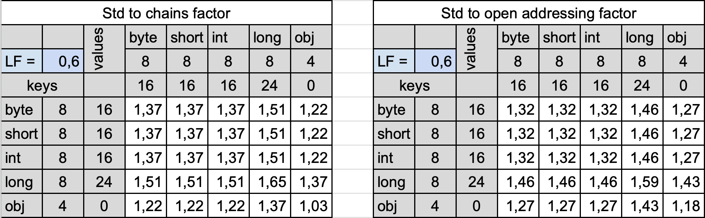

#### Generic implementation
Idea: all memory advantages of specialized implementations are concentrated on a primitive array. Therefore we can wrap a primitive array and all work with primitive type into `Storage<T>` class.

* one map implementation for all types, no code generation is needed
* a special generic reified fabric function allows to have only liner number of implementations rather than quadratic other case
* better memory usage and performance rather than long-long implementation redirecting 

Open addressing implementation of `MutableMap<K, V>` is [here](https://github.com/zuevmaxim/TypeSpecificCollections/blob/master/src/commonMain/kotlin/example/LinkedOpenHashMap.kt).

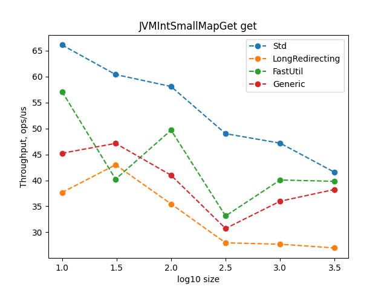

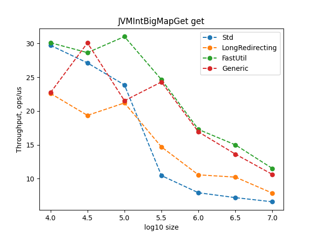

## ArrayList

Memory advantage is 2.5-3 times.

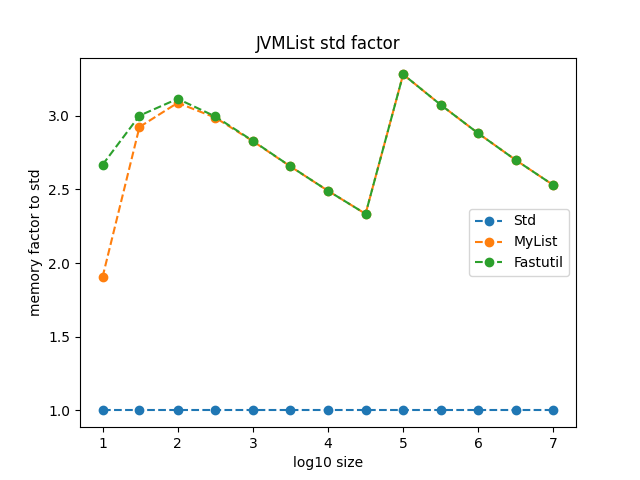

Implementation of `MutableList<Long, Long>` is [here](https://github.com/zuevmaxim/TypeSpecificCollections/blob/readme/src/commonMain/kotlin/example/LongArrayList.kt).

All operations with ArrayList are very simple so there are problems with performance(see next section).

## Problem

Map, List and other interfaces from standard library require returning Object in all methods therefore extra boxing is needed everywhere. This critically worsens performance when:
* ArrayList is used
* size of hash map is small
* operations like foreach are used

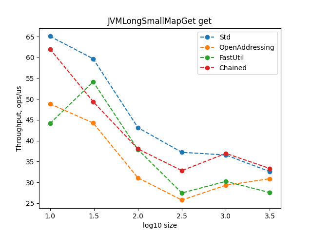

When size of hash map is small one extra boxing takes large part of get execution so standard implementation works better.

| Name          | Absolute | Std slowness factor |
|---------------|----------|---------------------|
| List sum      |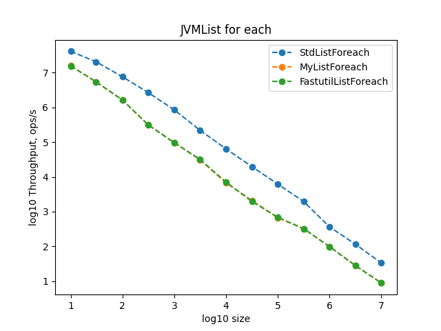|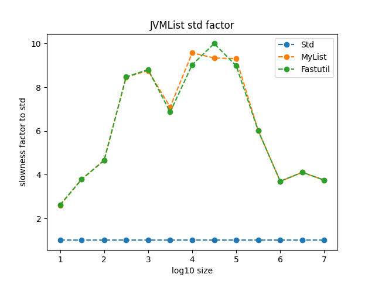|
| Small map sum |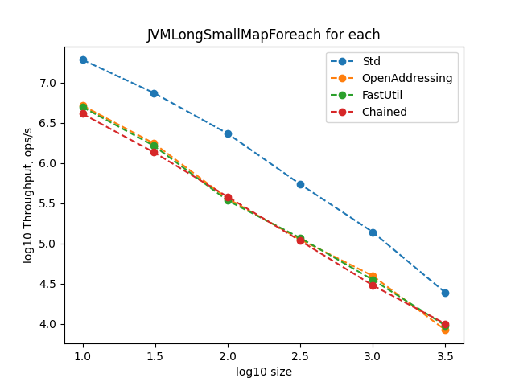|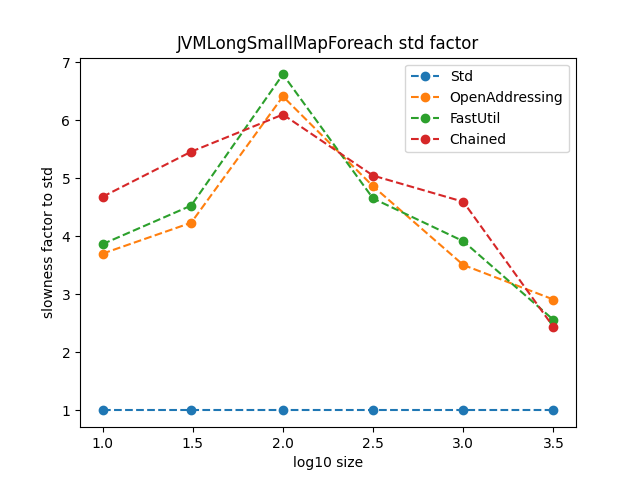|
| Big map sum   |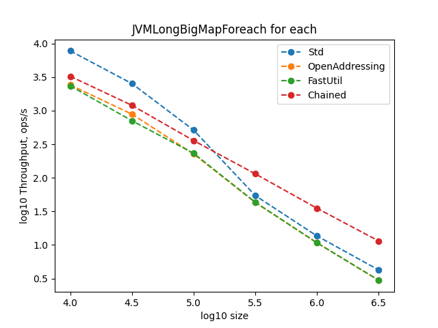|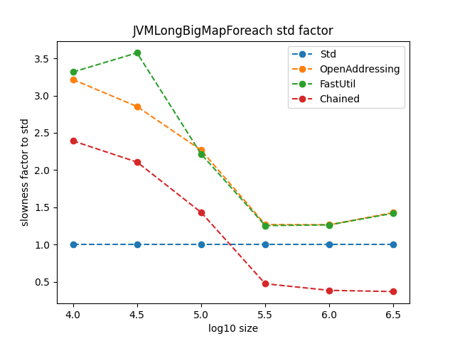|

Foreach(or sum) is a cheap operation so extra boxings are fatal for performance.

Profiler results of ArrayList sum:

| Name     | Profile |
|----------|---------|
| Std      |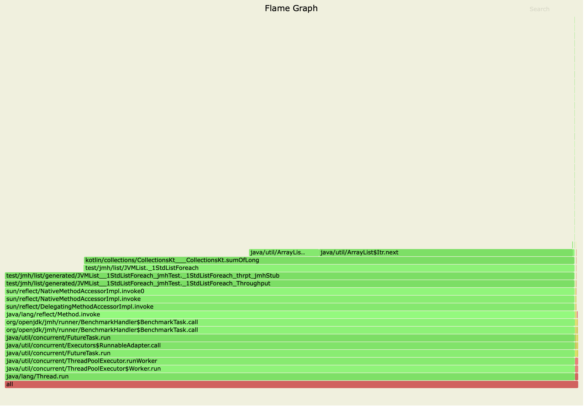|
| My list  |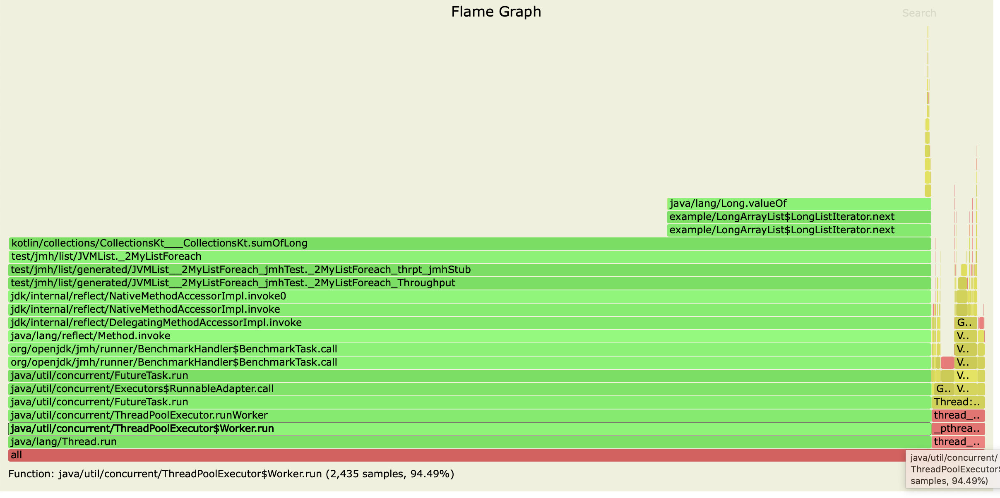|
| FastUtil |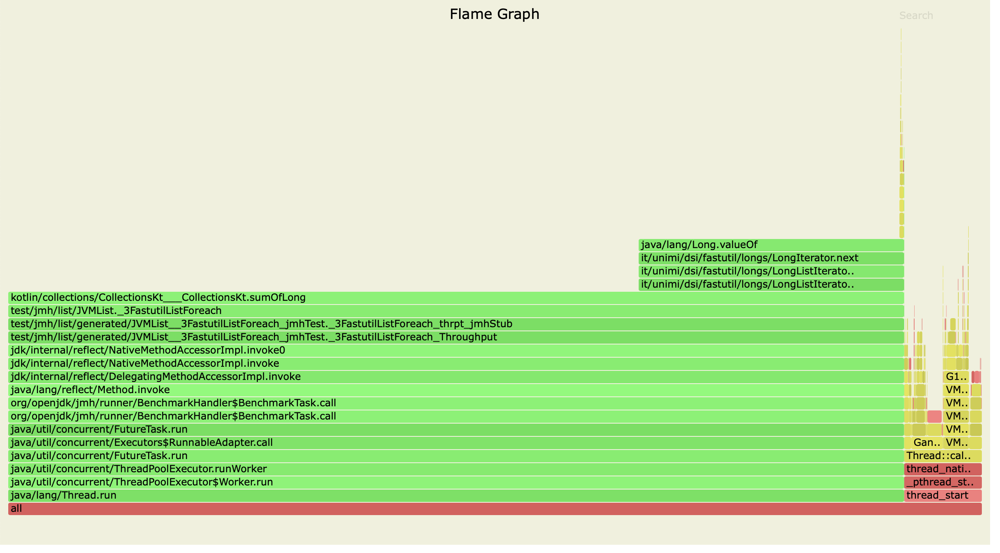|

The problem could be solved if special methods like `getOrDefault` are used:

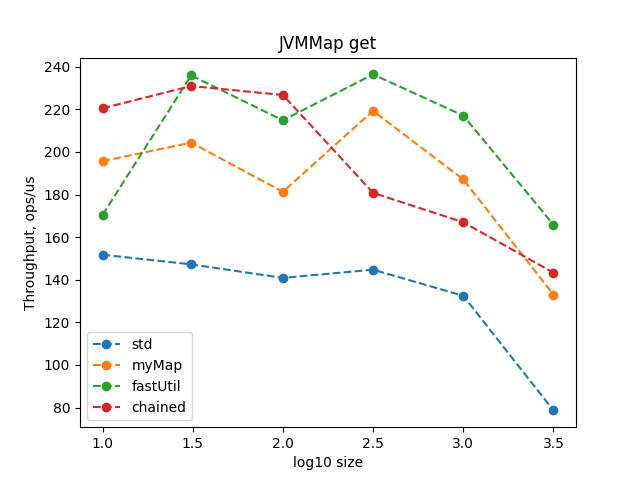

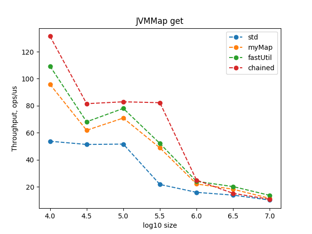
